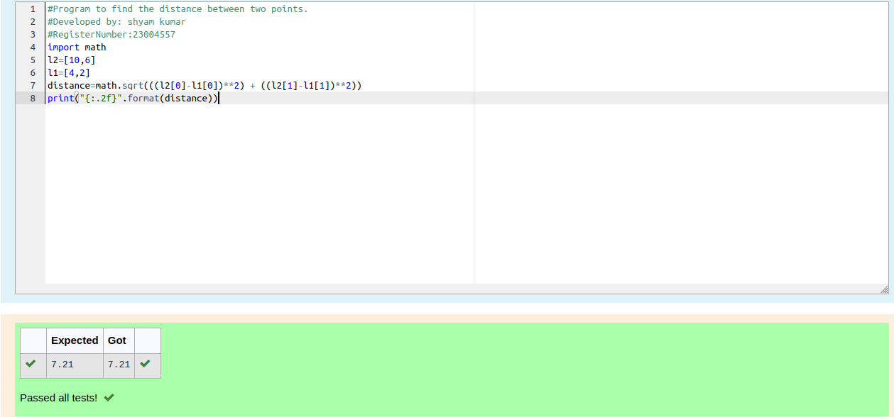

# DISTANCE-BETWEEN-TWO-POINTS

## AIM:
To write a python program to find the distance two 2 points
## ALGORITHM:
### Step 1: 
Import the math module.
### Step 2: 
Assign the values to the variables.
### Step 3: 
Substitute the values in the distance formula  
### Step 4: 
Print the distance.
### Step 5: 
End the program.
### PROGRAM:
```python 
#Program to find the distance between two points.
#Developed by: shyam kumar
#RegisterNumber:23004557
import math
l2=[10,6]
l1=[4,2]
distance=math.sqrt(((l2[0]-l1[0])**2) + ((l2[1]-l1[1])**2))
print("{:.2f}".format(distance))
```
  


### OUTPUT:



### RESULT:
Thus the program to find the distance between two points is written and verified using python programming.
